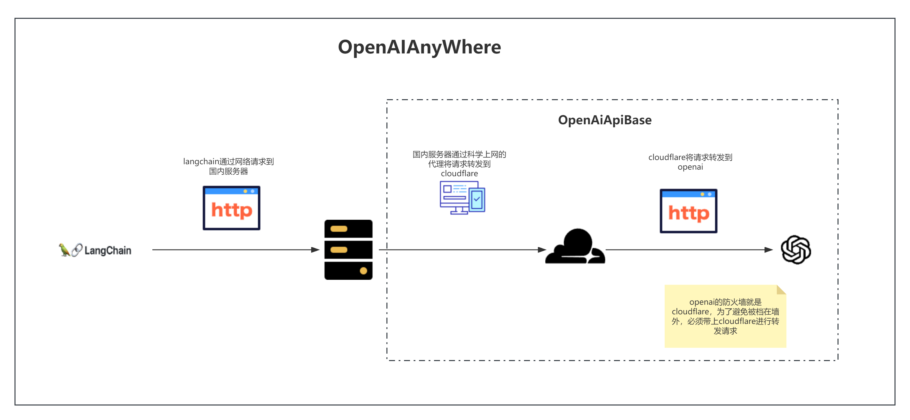
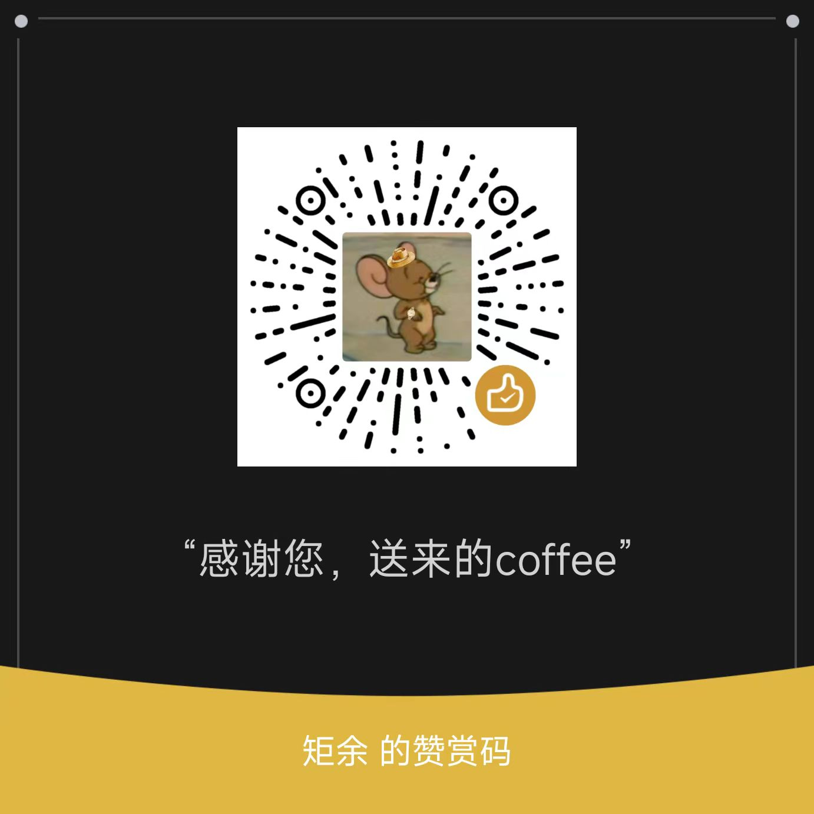

# OpenAIAnyWhere 😃
给openai的api做国内服务器转发，解决国内无法直接访问openai问题. 🌐

虽然目前有一些项目提供了国内转发服务，但是都未公开源码，不太放心，存在严重的数据安全问题，以及有可能存在api盗用问题，所以自己写了一个，方便自己使用，也方便大家使用。👍👏

## 整体架构
<div align="center">
     🖼️
</div>


## 🔍 前提条件
1. 💡 有一台国内服务器，配置好了科学上网，具体的可以百度linux安装v2ray
2. 💡 完成部署[OpenAiApiBase](https://github.com/XingYu-Zhong/OpenAiApiBase)项目，有了自己的target_url，比如https://xxx.pages.dev

## ⚡ 快速开始
### 配置config.json
```json
{
    "proxy_ip": "{代理ip}",
    "proxy_port": "{代理端口}",
    "flask_port": {flask端口},
    "target_url": "{目标url,例如：https://xxx.pages.dev}"
}
```


🛠️ 方式一：使用conda
```shell
# 创建环境
conda create -n openai python=3.10
# 激活环境
conda activate openai
# 安装依赖
pip install flask request
```
🛠️ 方式二：使用pip
```shell    
# 安装依赖
pip install flask request
```

### 直接运行
用于调试
```shell
python app.py
```
### 后台运行
```shell    
nohup python app.py > log.txt 2>&1 &
```

## 🚀 使用OpenAIAnyWhere
### 请求方式
💼 可以直接修改OPENAI_API_BASE环境变量，也可以在代码中指定
```python
import os
os.environ['OPENAI_API_BASE']='http://127.0.0.1:8123/v1'
from langchain.llms import OpenAI
llm = OpenAI()
llm('The quick brown fox jumps over the lazy dog')
```

## 🔒 配置https（可选）


✨ 方法一，添加ssl证书，使用绝对路径
```python
if __name__ == '__main__':
    app.run(host="0.0.0.0", port=config["flask_port"],ssl_context=('/usr/local/nginx/zhongxingyu.com_bundle.pem','/usr/local/nginx/zhongxingyu.com.key'))

```

✨ 方法二，使用自签名证书
```python   
if __name__ == '__main__':
    app.run(host="0.0.0.0", port=config["flask_port"],ssl_context=('adhoc'))
```
### 👥 贡献者

欢迎更多人能参与进来，感谢！

### 💰 赞助

欢迎用礼物来支持。

网络： USDT-TRC20



## 📝 许可证

MIT许可证

**免责声明：我们正在根据麻省理工学院教育许可证分享代码，供学术目的使用。此处并无任何财务建议，也不是交易真实货币的建议。请在交易或投资前始终首先使用常识，并咨询专业人士。**